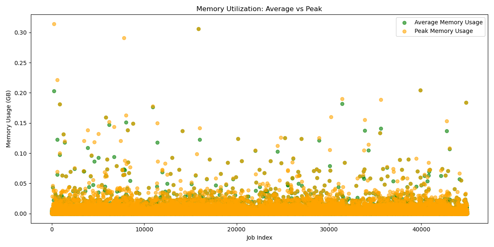

# Report Spark Project
Alessandra Cicciarelli, Matteo Ciccone

## 1. Analyses conducted

### 1.1 What is the distribution of the machines according to their CPU capacity?

For this question, we analyzed the `machine_events` file, focusing on the **CPU** field, which represents the CPU capacity of each machine. 

#### Methodology:
- Mapped each capacity value to `1` and summed the occurrences for each capacity using RDD transformations.
- Computed the distribution of machines by CPU capacity.

#### Results:
| **CPU Capacity** | **Number of Machines** |
|------------------|-------------------------|
| 0.5              | 35,015                 |
| 0.25             | 510                    |
| 1                | 2,223                  |


---

### 1.2 What is the percentage of computational power lost due to maintenance?

For this question, we again used the `machine_events` file, analyzing cases where `event_type = 1` (indicating that a machine was removed from the cluster).

#### Methodology:
1. **Data Preparation**:  
   - Used a window function to order data by `timestamp`, partitioned by `machine_id`.
   - Added two new columns to the DataFrame: the **next timestamp** and the **next event type**.
2. **Downtime Calculation**:  
   - Filtered rows where `event_type = 1` was followed by `event_type = 0` (indicating downtime).
   - Computed downtime as the difference between these timestamps.
   - Weighted downtime by CPU capacity.
3. **Percentage Calculation**:  
   - Divided the total lost computational power by the total available capacity to calculate the percentage of computational power lost.

#### Results:
| Metric                           | Value                      |
|----------------------------------|----------------------------|
| **Total Lost Capacity**          | 65,292,876,776,135.75      |
| **Total Available Capacity**     | 3,517,654,828,229,501.5    |
| **Percentage of Computation Lost** | 1.86%                     |

---

### 1.3 What is the distribution of the number of jobs/tasks per scheduling class?

This question focuses on the `job_events` and `task_events` tables, specifically analyzing the **schedule_class** field.

#### Methodology:
1. **Data Loading**:  
   - Read both `job_events` and `task_events` files.
2. **Mapping and Aggregation**:  
   - Mapped both datasets with `(schedule_class, 1)`.
   - Aggregated values using `reduceByKey()`.
3. **Analysis**:  
   - Generated individual plots for jobs and tasks.
   - Performed a `join()` operation to combine the analysis for jobs and tasks.
   - Computed the sum of values.
   - Created a final plot to display the distribution of tasks and jobs per class.

#### Results:
| Metric                | Distribution                                  |
|-----------------------|-----------------------------------------------|
| **Jobs Distribution** | ('3', 1,885), ('2', 3,030), ('1', 3,610), ('0', 2,179) |
| **Tasks Distribution**| ('3', 56,586), ('2', 97,482), ('1', 58,109), ('0', 237,969) |
| **Jobs/Tasks Combined**| ('3', 58,471), ('2', 100,512), ('1', 61,719), ('0', 240,148) |

#### Visualizations:
- **Jobs Distribution**  
    
  *The most used class for jobs is **1**.*

- **Tasks Distribution**  
    
  *The most used class for tasks is **0**.*

- **Jobs and Tasks Combined Distribution**  
    
  *When combined, the most used class remains **0**.*
---

### 1.4 Do tasks with a low scheduling class have a higher probability of being evicted?

This question focuses on the `task events` table, in particular on the **schedule_class** and **event_type** fields.

#### Methodology:
1. **Data Loading**:
  - Read the `task_event` file.
2. **Mapping and Aggregation**:
  - Mapped the entries with `(scheduling_class, (event_type, 1))` obtaining the `task_per_schedule` RDD.
  - Aggregated values per scheduling_class using `reduceByKey()`.
  - Filtered the `task_per_schedule` RDD to obtain an RDD with the evicted tasks.
  - Aggregated values per per scheduling_class using `reduceByKey()` for the only evicted tasks.
3. **Analysis**:
  - Performed a `join()` for scheduling_class to combine the total events per class and the total evicted events per class.
  - Computed the `eviction rate` per scheduling_class
  - Plotted the comparison between `eviction rate` and  `scheduling class`
  - Computed and printed the correlation between the `event type` and  the`scheduling class`

#### Results:
| Scheduling Class            | Eviction Rate                      |
|----------------------------------|----------------------------|
| **3**    |   0.04%  |
| **2**    |   0.68%  |
| **1**    |   1.36%  |
| **0**    |   1.20%  |
- **Eviction Rate for different Scheduling Class**  
    
  *The most evicted tasks are that with lower scheduling class: 0 and 1*

Another analysis done is the computation of the correlation between event_type and schedule_class: -0.19884144277296448. 

---
### 1.5 In general, do tasks from the same job run on the same machine?

This question focuses on the `task events` table, in particular on the **job_id** and **machine_id** fields.

#### Methodology:
1. **Data Loading**:
  - Read the `task_event` file.
2. **Mapping, Transformation and Aggregation**:
  - Filtered the entries to select the only tasks `SCHEDULED`,and mapped the entries with `(job_id, machine_id)` obtaining the `job_machine_pairs` RDD.
  - Grouped the RDD by the job ID, so that each key (job_id) will be associated with an iterable of all its corresponding  machine IDs. For each key-value pair produced by `groupByKey()`, we use the `mapValues()` transformation combined with the  `len(set(m))` which calculates the number of unique machine IDs (they are unique because we're using the `set(m)`). The RDD obtained is the `machines_per_job` RDD.
  - Counted the jobs which were runned on only one machine and then the total number of job in the `machines_per_job` RDD.

3. **Analysis**:
  - Computed the percentage of task from the same job runned on one machine.
  - Plotted the graph `Sample of Task Distribution by Machine` to show how the number of machines used varies across different jobs.
#### Results:
Percentage of task from the same job running on the same machine: `41.69%`  

#### Task from the same job distribution by machine

*The majority of tasks from the same job have been runned on one machine*

---

#### 1.6 Are the tasks that request the more resources the one that consume the more resources?
To address this question, we analyzed the `task_usage` and `task_events` tables. The sequence of transformations and actions performed was as follows:

1. **Mapping**: Extracted CPU and memory used/requested values, grouped by `jobid` and `task_index`.  
   Format: `[(jobid, task), (CPU, MEM)]`
2. **Aggregation**: Computed the average CPU and memory values using `reduceByKey()`.
3. **Joining**: Combined the tables to associate CPU and memory usage/request data.
4. **Cleaning and Formatting**: Processed the data to standardize and map it for analysis.
5. **Correlation Analysis**: Calculated the correlation between requested and used resources.
6. **Visualization**: Created scatter plots to visualize the relationship between resource requests and actual usage.

##### Results

##### Scatter Plots

- **CPU Request vs CPU Used**  
  

- **Memory Requested vs Memory Used**  
  

##### Correlation Metrics

| Metric                | Value                |
|-----------------------|----------------------|
| **CPU Correlation**   | 0.4469849108504573  |
| **Memory Correlation**| 0.5678103841836577  |

#### Analysis

From the scatter plots and the correlation values, we observe a moderate positive correlation between the requested and used resources for both CPU and memory. This indicates that while resource requests partially reflect actual usage, there is potential for optimization in resource allocation.

#### 1.7 Can we observe correlations between peaks of high resource consumption on some machines and task eviction events?
This question focuses on two datasets : `task_events`and `task_usage` on this relevant fields:
  - From task_events: task_index, job_id, machine_id and event_type.
  - From task_usage: task_index, job_id, machine_id, and resource metrics (max_mem, max_cpu).
### Methodology
1. **Data Loading:**
  - Read the `task_event` and  `task_usage` files.
2. **Mapping, Transformation and Aggregation:**
  - *Task Event*: Mapped the data to create an RDD of `((job-ID+task_index,machine_id), (event_type))` pairs.

  - *Resource Usage*: Mapped `task_usage` into an RDD of `((job-ID+task_index,machine_id), (max_mem, max_cpu))`.

  - Aggregated values in `tasksUsage` to obtain the maximum values for memory and CPU usage, so we can obtain the peaks for the consumption of these resources.

  - Joined the two RDD to obtain one RDD with: `((job-ID+task_index,machine_id), ((max_mem, max_cpu), event_type)`.
3. **Analysis:**
  - Prepared data for visualization, extracting only eviction rows.
  - Created plot with memory and CPU usage showing the distribution of evictions corresponding to different levels of resource usage peaks.

### Result 


#### Plot
- Correlation betwen resource consumption and eviction events


The analysis finds no substantial evidence linking peaks in resource usage to task evictions, suggesting other factors play a more critical role in determining eviction events.There are outliers scattered across the graph, particularly for Max Memory values ranging up to 0.16 and Max CPU values close to 1.0.
These outliers suggest that some tasks consume significantly higher resources, potentially representing unusual or high-load scenarios.

---

### 1.8 **Extra Analysis 1** Analysis of Task Priorities: Failure Rate and Distribution
This analysis focuses on the relationship between task priority and two main aspects:

- `Task Failure Rate`: The percentage of tasks that fail (event_type: FAIL, KILL, EVICT) out of the total tasks for each priority level.
- `Task Distribution by Priority`: The total number of tasks for each priority level to observe how tasks are distributed across priorities.
### Methodology
1. **Data Loading:**
   - Loaded the `task_events` dataset into a Spark DataFrame.

2. **Filtering and Aggregation:**
   - Filtered the task events to include only the relevant failure events (FAIL = 3, KILL = 5, EVICT = 2).
   - Calculated:
     - Total tasks for each priority level.
     - Total failures for each priority level.
   - Combined the data to compute the **failure rate** as:
     ```math
     Failure Rate = (Number Of Failures / Total Tasks) × 100 
     ```

3. **Visualization:**
   - Prepared the aggregated results for visualization by converting the Spark DataFrame into a Pandas DataFrame.
   - Created a dual-axis plot to show:
     - **Failure Rate:** A bar plot showing the percentage of failures for each priority.
     - **Total Tasks:** A line plot indicating the distribution of total tasks across priorities.

### Results

**Failure Rate and Task Distribution by Priority**

The bar plot represents the failure rate (%) for each task priority, while the line plot represents the total number of tasks for each priority.


1. **High Failure Rates:** 
   - Priority `0` tasks exhibit the highest failure rates, which could indicate insufficient resources or poor management for low-priority tasks.
2. **High Reliability for High Priorities:** 
   - Tasks with priority `9` have a large number of tasks and show very low failure rates, suggesting strong reliability and resource allocation.
3. **Rare Priorities:**
   - Certain priorities, like `1`, have very few tasks and low failure rates, indicating these may be reserved for specific critical tasks.
---
### 1.9 Analysis Report: Distribution of CPU and Memory Requests

The dataset was analyzed to understand the distribution of CPU and memory requests by tasks in the Google Cluster trace. This analysis aims to uncover patterns and insights into resource allocation, task behavior, and the overall usage of computational resources in the cluster.

**Steps**:
   - **Aggregation**: Tasks were grouped by their requested CPU and memory values, and the total count of tasks for each unique resource request was calculated.
   - **Visualization**: Bar charts were plotted to illustrate the frequency distribution of CPU and memory requests.

### Results

#### CPU Request Distribution


- **Observations**:
  - The majority of tasks requested minimal CPU resources, concentrated around the lower range (0.0 to 0.1 normalized units).
  - Peaks in the distribution are observed near specific small values, likely reflecting common task types or configurations.
  - Very few tasks requested more than 0.2 CPU units, indicating that high CPU-intensive tasks are rare in the cluster.

- **Insights**:
  - The cluster appears to serve a large number of lightweight tasks with minimal CPU requirements.
  - Optimizing for these low-CPU tasks might enhance overall scheduling efficiency and resource utilization.

#### Memory Request Distribution

- **Observations**:
  - Similar to CPU requests, the majority of tasks requested very low memory resources, primarily between 0.0 and 0.1 normalized units.
  - A sharp drop in frequency is visible for tasks requiring memory beyond 0.2 units.
  - There are occasional outliers with higher memory requests, but these are relatively rare.

- **Insights**:
  - The cluster workload is heavily dominated by memory-light tasks, which likely aligns with the lightweight nature of most jobs.
  - Resource allocation strategies can prioritize small memory allocations to maximize cluster efficiency.

### Conclusion
- Both CPU and memory requests show a highly skewed distribution, with most tasks requiring minimal resources.
- The results suggest a cluster workload predominantly consisting of lightweight tasks, with a small fraction of high-resource-consuming tasks.

# 2. Performance Evaluation and improvements

### 2.1 First analysis evaluation

#### Studies at the application level:

Trying to add caching on the most used RDD the result are the same this is due to the fact that few operation are executed on the RDD and the effect of caching are minimum.

```python
distrinctEntries = entries.map(lambda x: (x[1], x[cpu_capacity_index])).distinct().cache()

start = time.time()
# map(capacity, 1) then we aggregate the number by key
cpu_distribution = (
    distrinctEntries.map(lambda x: (x[1], 1))
            .reduceByKey(lambda a, b: a + b)
        .collect()
)

print("Execution time: ", time.time() - start)
```
#### RDD vs DataFrame

##### **Execution Times**
- **RDD Execution Time:** `2.11 seconds`
- **DataFrame Execution Time:** `0.12 seconds`


##### **RDD Stages**


  - The DAG shows multiple stages with intermediate shuffles due to transformations like `distinct` and `reduceByKey`.

##### **DataFrame Stages**

  - The DAG is simpler with fewer stages, as Spark optimized the entire query plan.

##### **Conclusion**
DataFrames demostrate better performance due to Spark's optimizations and they provide a more concise and declarative way for working with data.

#### Other Improvements

To further improve the performance of DataFrame operations, the following changes was implemented:

   - Repartitioned the DataFrame based on the `cpu_capacity` column to reduce shuffle and optimize parallelism
   - Filtered out null values from the `cpu_capacity` column early in the pipeline to avoid processing unnecessary data.
   - Enabled Adaptive Query Execution (AQE) to allow Spark to dynamically optimize the query plan.
   

### **2.2 Second Analysis Evaluation**

#### **RDD vs DataFrame**
As observed in the first analysis, DataFrames outperformed RDDs in terms of execution times and stage efficiency.

---

### **Performance Comparison**

#### **Execution Times**
- **RDD Execution Time:** `1.98 seconds`
- **DataFrame Execution Time:** `0.17 seconds`

---

### **RDD Stages**

  - The RDD implementation required **3 stages**.
  - Shuffle Read/Write sizes were consistent across stages but relatively higher (**666.2 KiB**).
  - Stage durations were longer, especially for stages involving `groupByKey` and subsequent reductions.

---

### **DataFrame Stages**

  - The DataFrame implementation required **7 completed stages**, with **6 skipped stages**, showcasing Spark's optimization capabilities (e.g., Catalyst optimizer).
  - The longest stages include Stage ID 6 and 9, lasting 0.4 seconds and 0.2 seconds, respectively.
  - Shuffle Read/Write sizes were significantly reduced (**e.g., 664.5 KiB**).
  - The use of Catalyst and Tungsten optimizations streamlined the overall execution, leading to shorter stage durations.

---

### **Conclusion**
1. **Execution Speed:**
   - DataFrames provided a **faster execution** compared to RDDs, largely due to better optimizations and reduced shuffle overhead.
   
2. **Shuffle Management:**
   - The DataFrame implementation demonstrated **lower shuffle read/write sizes**, making it more efficient for large-scale data operations.

3. **Stage Optimization:**
   - The DataFrame pipeline skipped unnecessary stages, further improving performance.

### **2.3 Third Analysis Evaluation**

#### Execution Time
- **RDD Execution Time:** `3.92 seconds`
- **DataFrame Execution Time:** `0.44 seconds`

### RDD Stages


### **DataFrame Stages**


- **Completed Stages:** 24  
- **Skipped Stages:** 14  
- **Execution Time:**  
  - Most stages executed in milliseconds (e.g., 0.01–0.1 seconds).
- **Shuffle Read/Write:**  
  - Shuffle Read and Write values are minimal (e.g., `248.0 B`).

- The high number of completed stages indicates significant fragmentation of tasks.
- The **Catalyst optimizer** and **Adaptive Query Execution (AQE)** reduce redundant computations, evidenced by the 14 skipped stages.
- However, the large number of stages introduces overhead in managing and coordinating these smaller tasks.
- Repeated `toPandas` conversions dominate many stages, which likely adds significant overhead when working with distributed datasets.

---

### **RDD Stages**


- **Completed Stages:** 8  
- **Skipped Stages:** 6  
- **Execution Time:**  
  - Execution times are longer per stage, with some stages taking up to 0.8 seconds.
- **Shuffle Read/Write:**  
  - **Shuffle Read:** Up to `734.9 KiB`.  
  - **Shuffle Write:** Up to `102.0 B`.  


- RDDs have significantly fewer stages, meaning less task fragmentation and coordination overhead.
- Higher shuffle operations compared to DataFrames are a notable drawback, but they are balanced by fewer overall stages.
- Stages take longer to complete compared to individual DataFrame stages, but the reduced number of stages compensates for this.

---
### 2.4 Analysis performance for the fourth question
#### Studies at the application level: 
Trying to add caching on the most used RDD `task_per_schedule` the results are the same or even worst, this is due to the fact that few operations are executed on the RDD, so for this analysis the caching is not useful.

Another optimization tried is to avoid the join between the two RDD: `total_per_class` and `total_evicted_per_class`, mapping  each entry in the `task_per_schedule` RDD to `(scheduling_class, (total_count, evicted_count))`. In this way the join is useless and it is possible to have an improvement of the performance.

```python
task_counts = task_per_schedule.map(lambda x: (
    x[0],  # scheduling_class as the key
    (1, 1 if x[1][0] == '2' else 0)  # (total_count, evicted_count)
))

# Reduce by key to sum up total and evicted counts
combined_counts = task_counts.reduceByKey(lambda a, b: (
    a[0] + b[0],  # Sum of total counts
    a[1] + b[1]   # Sum of evicted counts
))

# Calculate eviction rate
eviction_rate_per_class = combined_counts.mapValues(lambda x: x[1] / x[0])

```
- **Execution time with join:**  6.068982839584351 s
- **Execution time without join:**  5.5010459423065186 s

### RDD vs Dataframe

- **Execution time with RDD:**  5.834218978881836 s 
- **Execution time with dataframe:**  4.376155138015747 s
It is evident that using dataframe the performance are better than using RDD.

#### RDD Stages

#### Dataframe Stages


---
### **2.5 Fifth Analysis Evaluation**
#### Studies at the application level:
Trying to add caching on the most used RDD `machines_per_jon` the results are slightly better, but still is not possible to see a big improvement, because the RDD is used few times. After the analysis with caching these are the results obtained on the execution time:
- Execution time before optimization: 3.0019748210906982 s
- Execution time with caching: 2.735642671585083 s

### RDD vs Dataframe
#### RDD Stages

#### Dataframe Stages

### **2.6 Sixth Analysis Evaluation**


#### **Execution Time**

- **RDD Execution Time:** 35.48 seconds
- **DataFrame Execution Time:** 20.22 seconds

#### **RDD Stages**


- **Completed Stages:** 8  
- **Skipped Stages:** 6  
- **Execution Time:**  
  - Execution times are longer per stage, with some stages taking up to 0.8 seconds.
- **Shuffle Read/Write:**  
  - **Shuffle Read:** Up to `734.9 KiB`.  
  - **Shuffle Write:** Up to `102.0 B`.  

#### **DataFrame Stages**


- **Completed Stages:** 18  
- **Skipped Stages:** 14  
- **Execution Time:**  
  - Most stages executed in milliseconds (e.g., 0.01–0.1 seconds).
- **Shuffle Read/Write:**  
  - Shuffle Read and Write values are minimal (e.g., `248.0 B`).
#### **Conclusion**
In summary, DataFrames are better suited for this type of analysis, offering faster execution and more efficient handling of resource allocation data.
---

### **2.7 Seventh Analysis Evaluation**
#### Execution Time
- Execution time with RDD: 23.82987642288208  
- Execution Time with dataframe: 13.134239435195923 seconds 

This indicates that operations performed using DataFrames were significantly faster than those using RDDs. 
#### RDD Stages


The operations with RDDs resulted in 3 completed stages.
The execution relies heavily on user-defined logic and lacks the advanced query optimization features present in DataFrames.
#### Dataframe Stages


The operations with DataFrames resulted in 7 completed stages, indicating a more granular breakdown of the task execution. While the number of stages increased, the total execution time decreased because Spark optimizes each stage more effectively for DataFrames.

---

# Implementing a stream processing application

## Simulate streaming
We developed a Python script to simulate streaming of the `task_events` dataset. The data is ordered by timestamps, and the flow mimics a sequential arrival in real-time by using a socket to send data.

### **Functionality**
The script performs the following steps:
1. **Reads the File**: 
   - Opens the `task_events` dataset, which is compressed in `.gz` format.
2. **Orders the Data by Timestamp**:
   - The rows are sorted based on the `timestamp` field (the first column), ensuring chronological order.
3. **Configures a Socket**:
   - A socket server is set up to listen on port `9999` and send the data to a connected client.
4. **Simulates Real-Time Delay**:
   - Each row is sent sequentially.
   - The delay between sending rows is calculated based on the difference between their timestamps, simulating real-time behavior.

# Working in the Cloud  
## Deploying in the Cloud  

### 1. Project Initialization  
- We started by ensuring the necessary project setup on Google Cloud Platform (GCP).  
- The project used: **spark-project-446016**.  

### 2. Cluster Creation  
- We created a Dataproc cluster named **spark-cluster** to perform distributed PySpark analyses.  
- The cluster was configured with the following parameters:  
  - **Region**: `europe-west1`  
  - **Zone**: `europe-west1-b`  
  - **Master Node**: `n1-standard-4` machine type, 100GB boot disk.  
  - **Worker Nodes**: 2 worker nodes, each `n1-standard-4`, with 100GB boot disks.  
  - **Image Version**: `2.0-debian10`.  
- Command used:  
  ```bash  
  gcloud dataproc clusters create spark-cluster \  
      --region=europe-west1 \  
      --zone=europe-west1-b \  
      --master-machine-type=n1-standard-4 \  
      --master-boot-disk-size=100GB \  
      --num-workers=2 \  
      --worker-machine-type=n1-standard-4 \  
      --worker-boot-disk-size=100GB \  
      --image-version=2.0-debian10 \  
      --project=spark-project-446016  
  ```

### 3. Bucket Creation  
- To store scripts and datasets, we created a Google Cloud Storage bucket.  
- The bucket was created in the same region (`europe-west1`) to optimize latency and cost.  
- Command used:  
  ```bash  
  gcloud storage buckets create gs://spark-project-ciccone --location=europe-west1  
  ```  
- The bucket creation was verified using:  
  ```bash  
  gcloud storage buckets list  
  ```  

For the clusterData2019 we use the public bucket released by Google: `gs://clusterdata_2019_a/`.

### 4. Upload script
To execute the script for the analysis we had to upload it in the bucket:
```bash
gsutil cp instance_usage_analysis.py gs://spark-project-ciccone/
```

### 5. Run script on the Cluster

```bash
gcloud dataproc jobs submit pyspark gs://spark-project-ciccone/instance_usage_analysis.py \
    --cluster=spark-cluster \
    --region=europe-west1
```

In this example I runned a test that just read the first rows of the csv file `gs://clusterdata_2019_a/instance_usage-000000000000.json.gz` and save it in my bucket  `gs://spark-project-ciccone/test_output/`.

This is the result:
```bash
gsutil ls gs://spark-project-ciccone/test_output 
gs://spark-project-ciccone/test_output/
gs://spark-project-ciccone/test_output/_SUCCESS
gs://spark-project-ciccone/test_output/part-00000-6ff60f71-461f-42e3-af3f-580482afe58c-c000.csv
gs://spark-project-ciccone/test_output/part-00001-6ff60f71-461f-42e3-af3f-580482afe58c-c000.csv
```

## ClusterData2019 Analysis

First of all we discovered the structure of the files to analyze.

### Instance Usage Table
| alloc_collection_id | alloc_instance_index | assigned_memory | average_usage                          | collection_id | collection_type | cpu_usage_distribution                                                                                                                                                               | cycles_per_instruction | end_time     | instance_index | machine_id   | maximum_usage                          | memory_accesses_per_instruction | page_cache_memory | random_sample_usage | sample_rate | start_time   | tail_cpu_usage_distribution                                                                                                                                                      |
|---------------------|----------------------|-----------------|----------------------------------------|---------------|-----------------|------------------------------------------------------------------------------------------------------------------------------------------------------------------------------------|-------------------------|--------------|----------------|--------------|---------------------------------------|--------------------------------|------------------|--------------------|-------------|--------------|-----------------------------------------------------------------------------------------------------------------------------------------------------------------|
| 330587160469        | 111                 | 0.0             | {0.008392333984375, 0.0094757080078125} | 330587238433  | 0               | [4.711e-4, 6.809e-4, 7.582e-4, 8.316e-4, 9.623e-4, 0.0084, 0.00888, 0.0133, 0.0164, 0.0219, 0.0478]                                                                                 | 0.8992                  | 1838700000000 | 111            | 23624491139 | {0.0479, 0.0194}                      | 0.0015                        | 0.0032          | {0.0166}          | 0.9967      | 1838400000000 | [0.0223, 0.0237, 0.0242, 0.0254, 0.0261, 0.0269, 0.0284, 0.0309, 0.037]                                                                                                             |
| 330587160469        | 111                 | 0.0             | {0.0271, 0.0276}                        | 330587238433  | 0               | [0.0088, 0.0164, 0.0186, 0.0206, 0.0221, 0.0244, 0.0266, 0.0291, 0.0344, 0.042, 0.0736]                                                                                           | 0.8992                  | 1839300000000 | 111            | 23624491139 | {0.0736, 0.028}                       | 0.0015                        | 0.0018          | {0.0197}          | 1.0         | 1839000000000 | [0.0429, 0.0441, 0.0466, 0.0475, 0.0485, 0.0524, 0.0577, 0.0647, 0.0673]                                                                                                            |
| 330587160469        | 111                 | 0.0             | {0.0249, 0.0125}                        | 330587238433  | 0               | [5.436e-5, 2.012e-4, 4.139e-4, 0.0086, 0.0093, 0.0253, 0.0356, 0.0428, 0.0477, 0.0511, 0.0645]                                                                                    | 1.0287                  | 942300000000  | 111            | 23624491139 | {0.1177, 0.0193}                      | 0.0034                        | 0.0024          | {0.0086}          | 1.0         | 942000000000  | [0.052, 0.0525, 0.0527, 0.053, 0.0533, 0.0544, 0.055, 0.056, 0.0591]                                                                                                               |

---
### Instance Event Table
| alloc_collection_id | alloc_instance_index | collection_id | collection_type | constraint | instance_index | machine_id  | missing_type | priority | resource_request                   | scheduling_class | time         | type |
|---------------------|----------------------|---------------|-----------------|------------|----------------|-------------|--------------|----------|-------------------------------------|------------------|--------------|------|
| 0                   | -1                  | 394850707867  | 0               | []         | 249            | 92097052846 | 1            | 114      | {0.02862548828125, 0.0113525390625} | 0                | 1992813863543 | 8    |
| 0                   | -1                  | 394454896092  | 0               | []         | 964            | 938684710   | 1            | 114      | {0.03265380859375, 0.010528564453125}| 0                | 1977541446075 | 8    |

### Machine Events Table
| capacity | machine_id  | platform_id                                 | switch_id                                   | time         | type |
|----------|-------------|---------------------------------------------|---------------------------------------------|--------------|------|
| null     | 385611578151 | JQ1tVQBMHBAIISU1gUNXk2powhYumYA+4cB3KzU29l8= | +1VWJQsXJiHPTnLfEiJRudzQxErmdD00l4Iwh+Z/MYA= | 1687655299440 | 1    |
| null     | 375997586330 | JQ1tVQBMHBAIISU1gUNXk2powhYumYA+4cB3KzU29l8= | +MID0TPk5AtCYpEsp9KxczyeufvrlAO6fiXWiUht754= | 90134737257   | 1    |
| null     | 375997549382 | JQ1tVQBMHBAIISU1gUNXk2powhYumYA+4cB3KzU29l8= | +MID0TPk5AtCYpEsp9KxczyeufvrlAO6fiXWiUht754= | 90077226715   | 1    |

---

### Machine Attributes Table
| deleted | machine_id  | name                                        | time         | value |
|---------|-------------|---------------------------------------------|--------------|-------|
| true    | 21210060    | 1UIj3ffhIWncZ1cXFJKt332Tx9w9O4hPajzZkapbc6I= | 2223892268687 | null  |
| true    | 21799165    | 1UIj3ffhIWncZ1cXFJKt332Tx9w9O4hPajzZkapbc6I= | 2653423240621 | null  |
| true    | 1638743919  | 1UIj3ffhIWncZ1cXFJKt332Tx9w9O4hPajzZkapbc6I= | 2539365067032 | null  |

### Collection Event Table
| alloc_collection_id | collection_id | collection_logical_name                 | collection_name                          | collection_type | max_per_machine | max_per_switch | missing_type | parent_collection_id | priority | scheduler | scheduling_class | start_after_collection_ids | time         | type | user                                        | vertical_scaling |
|---------------------|---------------|------------------------------------------|------------------------------------------|-----------------|-----------------|----------------|--------------|------------------------|----------|-----------|------------------|----------------------------|--------------|------|--------------------------------------------|-----------------|
| null                | 396233419682 | KJ8MV0Juy9uRXkIXxeA23iH+VVSuQ9++X+zRcNfUsEg= | uPV3/TgB5WMfJTzMEzf3tJaHuDqfgiSXFbBVl2UYWb8= | 0               | null            | null           | null         | null                   | 103      | 1         | 1                | []                         | 2181847986340 | 5    | /o4X3IunK+hhQOPr+NRkjWgxjdJlGtk9ujTmgsSlZKc= | 2               |
| null                | 385607584057 | bA/e9j8XWFimoE+RPjLjIgNOKj0m24eFDSE8fjQL6Ho= | os7lm8wNvvr9P9qkeuA8zQY5bosEiARvh1UbtivIYG8= | 0               | null            | null           | null         | null                   | 0        | 0         | 3                | []                         | 1685777786697 | 5    | RafrUOPLtxAkG9IUoVaF8YjjXcVPt1EnEP6Zn+cQ/ko= | 1               |
| null                | 374545742577 | mg4mwEDKc+7KvBT0lgyKDKjS8u4O75FVf32/ETjywp8= | hiKHkc1co2UVp0OV41U2Tz3UsJIzV/ZlLBE5k/abQ4k= | 0               | null            | null           | null         | null                   | 115      | 1         | 2                | []                         | 65326129736   | 5    | 12boQYioSPNeQSIhS/xwdE0K9pZ8Dqtfyr5X2MtxmZQ= | 1               |


## Resource Utilization Analysis Report

### Objective
Analyze CPU and Memory utilization across jobs, focusing on:
- Average and peak CPU usage.
- Average and peak memory usage.
---

### Key Observations
#### 1. **CPU Utilization**:
- **Average CPU Usage**:
  - Most jobs have low average CPU usage (<0.1 GCU).
- **Peak CPU Usage**:
  - A few jobs exhibit high peak usage (>0.6 GCU), suggesting resource-intensive jobs.

#### 2. **Memory Utilization**:
- **Average Memory Usage**:
  - Jobs mostly consume low average memory (<0.05 GB).
- **Peak Memory Usage**:
  - Some jobs exceed a peak memory usage of 0.3 GB.

#### 3. **Job Execution Metrics**:
- **YARN Memory Allocation**:
  - Consistent memory allocation across jobs, with peaks corresponding to job submissions.
- **CPU Utilization**:
  - Peaks of up to 15% during heavy job execution phases.
- **Network and Disk I/O**:
  - Clear spikes in network and disk activities during job execution, indicating data-intensive operations.

---

### Output Paths
#### 1. **Resource Utilization Metrics** (CSV Files)
Saved in `gs://spark-project-ciccone/cpu_memory_analysis_output/`:
- `_SUCCESS` (completion marker)
- `part-00000-e801254b-185c-4088-8f1f-a055bd9f4404-c000.csv`
- `part-00001-e801254b-185c-4088-8f1f-a055bd9f4404-c000.csv`
- `part-00002-e801254b-185c-4088-8f1f-a055bd9f4404-c000.csv`
- `part-00003-e801254b-185c-4088-8f1f-a055bd9f4404-c000.csv`
- `part-00004-e801254b-185c-4088-8f1f-a055bd9f4404-c000.csv`

#### 2. **Plots**
Saved in `gs://spark-project-ciccone/cpu_memory_analysis/`:
- `cpu_memory_analysis_plot.png`
- `cpu_utilization_plot.png`
- `memory_utilization_plot.png`

---

### Resource Utilization Plots
#### CPU Utilization - Average vs. Peak


#### Memory Utilization - Average vs. Peak


### Google Cloud Platform Job Execution Metrics
#### Dashboard 1: YARN Resource Allocation


#### Dashboard 2: Job Metrics


---

## Evaluation of Time-to-Failure Histogram


### Key Observations:
1. **High Initial Frequency**:
   - A significant number of failures occur within a very short interval, indicating that machines fail shortly after recovery or initialization.

2. **Distribution Tail**:
   - The tail shows a gradual decline in the frequency of time-to-failure intervals, suggesting that fewer machines experience prolonged operational periods without failure.

3. **Clusters Around Specific Durations**:
   - Distinct peaks suggest patterns or cycles in machine failures, potentially tied to workloads, scheduled maintenance, or recurring hardware issues.

### Output Paths

Saved in `gsutil ls gs://spark-project-ciccone/machine_failure_analysis_plots/`
- `failure_counts_plot.png`
- `failure_rate_plot.png`
- `failure_trends_plot.png`
- `time_to_failure_histogram.png`
 
---

# Study of related publications
## Borg: the Next Generation
The "Borg: The Next Generation" paper provides a comparison of Google's `2011` and `2019` cluster traces, analyzing a trace from `eight Borg clusters` for May 2019, comparing it to Google's 2011 trace. \
The focus of the paper is about evolution in Borg, such as new features, changes in workloads or higher job arrival rates.  \
### 1. What is Borg? 
`Borg` is a cluster management system with a `centralized scheduler` that allocates tasks (individual replicas of jobs) to machines in a cluster (cell). Each task requests resources such as CPU and memory, and jobs are prioritized based on their importance. Borg also supports resource overcommitment and vertical scaling, dynamically adjusting resource limits for tasks.
### 2. Difference from 2011 and 2019 Traces

We said that the first is difference between the traces it's about the number of clusters: eight in the 2019, and only one in 2011. Then, these are the most important changes: 


### 3. Resource Utilization
`Resource utilization` increased from 2011 to 2019 due to a shift toward the best-effort batch tier, which now consumes more CPU and memory. The use of statistical multiplexing to overcommit resources has grown, particularly for memory. Borg has maintained a balance by improving `scheduling efficiency` and `reducing resource slack`.

### 4. Machine Utilization:

`Machines` are used more consistently in 2019 compared to 2011, with fewer under- or over-utilized machines, because the scheduler is doing a better job in 2019 than it did in 2011 in terms of distributing workload across the cell and the machines. Despite improvements, utilization remains below full capacity due to factors like disaster recovery protocols and machine constraints.

### 5. New Borg Features and Trace Properties:

-  `Alloc Sets`: Reserved machine resources for jobs, alloc information was not included in the 2011's trace, but is included in the 2019
one.

- `Job Dependencies`: Allowing automatic cleanup of child jobs when parent jobs terminate, permitting
more sophisticated failure analyses.

- `Batch Queuing`: Scheduling batch jobs for higher throughput is being added and it manages the aggregate batch job workload.

- `Vertical Scaling`: Automated resource limits adjustments during task execution, reducing slack and improving efficiency.This is done using a system called Autopilot. The trace indicates which jobs were subject to
this autoscaling.

### 6. Evolution in the Scheduling Load:

`Job submission rates` grew 3.7× from 2011 to 2019, while the task submission rate rose 7×. Despite this, the Borg scheduler handles the increased load with reduced median scheduling delays. Production-tier jobs are prioritized, and new features like batch scheduling help manage the workload.

### 7. Resource Consumption:
`Resource consumption` follows a heavy-tailed distribution, with the top 1% of jobs (resource "hogs") consuming over 99% of resources. These large jobs create challenges for scheduling, requiring isolation strategies to protect smaller jobs (the "mice") from queueing delays.

#### Comparison with 2011 Data:

Both 2011 and 2019 data exhibit heavy-tailed distributions, but the 2019 workload is more extreme. The squared coefficient of variation (C²) for resource usage increased significantly, emphasizing the growing disparity between small and large jobs.

### 8. Conclusions:

The paper focuses on how the 2019 trace captures significant advancements in Borg's capabilities. While resource utilization and workload complexity have increased, Borg's scheduler has become more efficient. 

