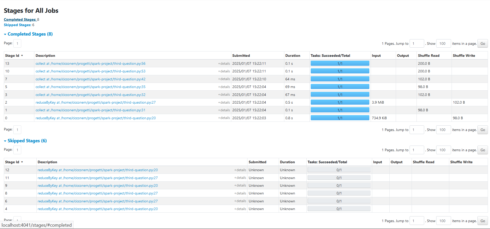

# Report Spark Project
Alessandra Cicciarelli, Matteo Ciccone

## 1. Analyses conducted

### 1.1 What is the distribution of the machines according to their CPU capacity?

For this question, we analyzed the `machine_events` file, focusing on the **CPU** field, which represents the CPU capacity of each machine. 

#### Methodology:
- Mapped each capacity value to `1` and summed the occurrences for each capacity using RDD transformations.
- Computed the distribution of machines by CPU capacity.

#### Results:
| **CPU Capacity** | **Number of Machines** |
|------------------|-------------------------|
| 0.5              | 35,015                 |
| 0.25             | 510                    |
| 1                | 2,223                  |


---

### 1.2 What is the percentage of computational power lost due to maintenance?

For this question, we again used the `machine_events` file, analyzing cases where `event_type = 1` (indicating that a machine was removed from the cluster).

#### Methodology:
1. **Data Preparation**:  
   - Used a window function to order data by `timestamp`, partitioned by `machine_id`.
   - Added two new columns to the DataFrame: the **next timestamp** and the **next event type**.
2. **Downtime Calculation**:  
   - Filtered rows where `event_type = 1` was followed by `event_type = 0` (indicating downtime).
   - Computed downtime as the difference between these timestamps.
   - Weighted downtime by CPU capacity.
3. **Percentage Calculation**:  
   - Divided the total lost computational power by the total available capacity to calculate the percentage of computational power lost.

#### Results:
| Metric                           | Value                      |
|----------------------------------|----------------------------|
| **Total Lost Capacity**          | 65,292,876,776,135.75      |
| **Total Available Capacity**     | 3,517,654,828,229,501.5    |
| **Percentage of Computation Lost** | 1.86%                     |

---

### 1.3 What is the distribution of the number of jobs/tasks per scheduling class?

This question focuses on the `job_events` and `task_events` tables, specifically analyzing the **schedule_class** field.

#### Methodology:
1. **Data Loading**:  
   - Read both `job_events` and `task_events` files.
2. **Mapping and Aggregation**:  
   - Mapped both datasets with `(schedule_class, 1)`.
   - Aggregated values using `reduceByKey()`.
3. **Analysis**:  
   - Generated individual plots for jobs and tasks.
   - Performed a `join()` operation to combine the analysis for jobs and tasks.
   - Computed the sum of values.
   - Created a final plot to display the distribution of tasks and jobs per class.

#### Results:
| Metric                | Distribution                                  |
|-----------------------|-----------------------------------------------|
| **Jobs Distribution** | ('3', 1,885), ('2', 3,030), ('1', 3,610), ('0', 2,179) |
| **Tasks Distribution**| ('3', 56,586), ('2', 97,482), ('1', 58,109), ('0', 237,969) |
| **Jobs/Tasks Combined**| ('3', 58,471), ('2', 100,512), ('1', 61,719), ('0', 240,148) |

#### Visualizations:
- **Jobs Distribution**  
    
  *The most used class for jobs is **1**.*

- **Tasks Distribution**  
    
  *The most used class for tasks is **0**.*

- **Jobs and Tasks Combined Distribution**  
    
  *When combined, the most used class remains **0**.*
---

### 1.4 Do tasks with a low scheduling class have a higher probability of being evicted?

This question focuses on the `task events` table, in particular on the **schedule_class** and **event_type** fields.

#### Methodology:
1. **Data Loading**:
  - Read the `task_event` file.
2. **Mapping and Aggregation**:
  - Mapped the entries with `(scheduling_class, (event_type, 1))` obtaining the `task_per_schedule` RDD.
  - Aggregated values per scheduling_class using `reduceByKey()`.
  - Filtered the `task_per_schedule` RDD to obtain an RDD with the evicted tasks.
  - Aggregated values per per scheduling_class using `reduceByKey()` for the only evicted tasks.
3. **Analysis**:
  - Performed a `join()` for scheduling_class to combine the total events per class and the total evicted events per class.
  - Computed the `eviction rate` per scheduling_class
  - Plotted the comparison between `eviction rate` and  `scheduling class`
  - Computed and printed the correlation between the `event type` and  the`scheduling class`

#### Results:
| Scheduling Class            | Eviction Rate                      |
|----------------------------------|----------------------------|
| **3**    |   0.04%  |
| **2**    |   0.68%  |
| **1**    |   1.36%  |
| **0**    |   1.20%  |
- **Eviction Rate for different Scheduling Class**  
    
  *The most evicted tasks are that with lower scheduling class: 0 and 1*

Another analysis done is the computation of the correlation between event_type and schedule_class: -0.19884144277296448. 

---
### 1.5 In general, do tasks from the same job run on the same machine?

This question focuses on the `task events` table, in particular on the **job_id** and **machine_id** fields.

#### Methodology:
1. **Data Loading**:
  - Read the `task_event` file.
2. **Mapping, Transformation and Aggregation**:
  - Filtered the entries to select the only tasks `SCHEDULED`,and mapped the entries with `(job_id, machine_id)` obtaining the `job_machine_pairs` RDD.
  - Grouped the RDD by the job ID, so that each key (job_id) will be associated with an iterable of all its corresponding  machine IDs. For each key-value pair produced by `groupByKey()`, we use the `mapValues()` transformation combined with the  `len(set(m))` which calculates the number of unique machine IDs (they are unique because we're using the `set(m)`). The RDD obtained is the `machines_per_job` RDD.
  - Counted the jobs which were runned on only one machine and then the total number of job in the `machines_per_job` RDD.

3. **Analysis**:
  - Computed the percentage of task from the same job runned on one machine.
  - Plotted the graph `Sample of Task Distribution by Machine` to show how the number of machines used varies across different jobs.
#### Results:
Percentage of task from the same job running on the same machine: `41.69%`  

#### Task from the same job distribution by machine

*The majority of tasks from the same job have been runned on one machine*

---

#### 1.6 Are the tasks that request the more resources the one that consume the more resources?
To address this question, we analyzed the `task_usage` and `task_events` tables. The sequence of transformations and actions performed was as follows:

1. **Mapping**: Extracted CPU and memory used/requested values, grouped by `jobid` and `task_index`.  
   Format: `[(jobid, task), (CPU, MEM)]`
2. **Aggregation**: Computed the average CPU and memory values using `reduceByKey()`.
3. **Joining**: Combined the tables to associate CPU and memory usage/request data.
4. **Cleaning and Formatting**: Processed the data to standardize and map it for analysis.
5. **Correlation Analysis**: Calculated the correlation between requested and used resources.
6. **Visualization**: Created scatter plots to visualize the relationship between resource requests and actual usage.

##### Results

##### Scatter Plots

- **CPU Request vs CPU Used**  
  

- **Memory Requested vs Memory Used**  
  

##### Correlation Metrics

| Metric                | Value                |
|-----------------------|----------------------|
| **CPU Correlation**   | 0.4469849108504573  |
| **Memory Correlation**| 0.5678103841836577  |

#### Analysis

From the scatter plots and the correlation values, we observe a moderate positive correlation between the requested and used resources for both CPU and memory. This indicates that while resource requests partially reflect actual usage, there is potential for optimization in resource allocation.

#### 1.7 Can we observe correlations between peaks of high resource consumption on some machines and task eviction events?
This question focuses on two datasets : `task_events`and `task_usage` on this relevant fields:
  - From task_events: task_index, job_id, machine_id and event_type.
  - From task_usage: task_index, job_id, machine_id, and resource metrics (max_mem, max_cpu).
### Methodology
1. **Data Loading:**
  - Read the `task_event` and  `task_usage` files.
2. **Mapping, Transformation and Aggregation:**
  - *Task Event*: Mapped the data to create an RDD of `((job-ID+task_index,machine_id), (event_type))` pairs.

  - *Resource Usage*: Mapped `task_usage` into an RDD of `((job-ID+task_index,machine_id), (max_mem, max_cpu))`.

  - Aggregated values in `tasksUsage` to obtain the maximum values for memory and CPU usage, so we can obtain the peaks for the consumption of these resources.

  - Joined the two RDD to obtain one RDD with: `((job-ID+task_index,machine_id), ((max_mem, max_cpu), event_type)`.
3. **Analysis:**
  - Prepared data for visualization, extracting only eviction rows.
  - Created plot with memory and CPU usage showing the distribution of evictions corresponding to different levels of resource usage peaks.

### Result 


#### Plot
- Correlation betwen resource consumption and eviction events


The analysis finds no substantial evidence linking peaks in resource usage to task evictions, suggesting other factors play a more critical role in determining eviction events.There are outliers scattered across the graph, particularly for Max Memory values ranging up to 0.16 and Max CPU values close to 1.0.
These outliers suggest that some tasks consume significantly higher resources, potentially representing unusual or high-load scenarios.

# 2. Performance Evaluation and improvements

### 2.1 First analysis evaluation

#### Studies at the application level:

Trying to add caching on the most used RDD the result are the same this is due to the fact that few operation are executed on the RDD and the effect of caching are minimum.

```python
distrinctEntries = entries.map(lambda x: (x[1], x[cpu_capacity_index])).distinct().cache()

start = time.time()
# map(capacity, 1) then we aggregate the number by key
cpu_distribution = (
    distrinctEntries.map(lambda x: (x[1], 1))
            .reduceByKey(lambda a, b: a + b)
        .collect()
)

print("Execution time: ", time.time() - start)
```
#### RDD vs DataFrame

##### **Execution Times**
- **RDD Execution Time:** `2.11 seconds`
- **DataFrame Execution Time:** `0.12 seconds`


##### **RDD Stages**


  - The DAG shows multiple stages with intermediate shuffles due to transformations like `distinct` and `reduceByKey`.

##### **DataFrame Stages**

  - The DAG is simpler with fewer stages, as Spark optimized the entire query plan.

##### **Conclusion**
DataFrames demostrate better performance due to Spark's optimizations and they provide a more concise and declarative way for working with data.

#### Other Improvements

To further improve the performance of DataFrame operations, the following changes was implemented:

   - Repartitioned the DataFrame based on the `cpu_capacity` column to reduce shuffle and optimize parallelism
   - Filtered out null values from the `cpu_capacity` column early in the pipeline to avoid processing unnecessary data.
   - Enabled Adaptive Query Execution (AQE) to allow Spark to dynamically optimize the query plan.
   

### **2.2 Second Analysis Evaluation**

#### **RDD vs DataFrame**
As observed in the first analysis, DataFrames outperformed RDDs in terms of execution times and stage efficiency.

---

### **Performance Comparison**

#### **Execution Times**
- **RDD Execution Time:** `1.98 seconds`
- **DataFrame Execution Time:** `0.17 seconds`

---

### **RDD Stages**

  - The RDD implementation required **3 stages**.
  - Shuffle Read/Write sizes were consistent across stages but relatively higher (**666.2 KiB**).
  - Stage durations were longer, especially for stages involving `groupByKey` and subsequent reductions.

---

### **DataFrame Stages**

  - The DataFrame implementation required **7 completed stages**, with **6 skipped stages**, showcasing Spark's optimization capabilities (e.g., Catalyst optimizer).
  - The longest stages include Stage ID 6 and 9, lasting 0.4 seconds and 0.2 seconds, respectively.
  - Shuffle Read/Write sizes were significantly reduced (**e.g., 664.5 KiB**).
  - The use of Catalyst and Tungsten optimizations streamlined the overall execution, leading to shorter stage durations.

---

### **Conclusion**
1. **Execution Speed:**
   - DataFrames provided a **faster execution** compared to RDDs, largely due to better optimizations and reduced shuffle overhead.
   
2. **Shuffle Management:**
   - The DataFrame implementation demonstrated **lower shuffle read/write sizes**, making it more efficient for large-scale data operations.

3. **Stage Optimization:**
   - The DataFrame pipeline skipped unnecessary stages, further improving performance.

### **2.3 Third Analysis Evaluation**

#### Execution Time
- **RDD Execution Time:** `3.92 seconds`
- **DataFrame Execution Time:** `0.44 seconds`

### RDD Stages


### **DataFrame Stages**


- **Completed Stages:** 24  
- **Skipped Stages:** 14  
- **Execution Time:**  
  - Most stages executed in milliseconds (e.g., 0.01–0.1 seconds).
- **Shuffle Read/Write:**  
  - Shuffle Read and Write values are minimal (e.g., `248.0 B`).

- The high number of completed stages indicates significant fragmentation of tasks.
- The **Catalyst optimizer** and **Adaptive Query Execution (AQE)** reduce redundant computations, evidenced by the 14 skipped stages.
- However, the large number of stages introduces overhead in managing and coordinating these smaller tasks.
- Repeated `toPandas` conversions dominate many stages, which likely adds significant overhead when working with distributed datasets.

---

### **RDD Stages**


- **Completed Stages:** 8  
- **Skipped Stages:** 6  
- **Execution Time:**  
  - Execution times are longer per stage, with some stages taking up to 0.8 seconds.
- **Shuffle Read/Write:**  
  - **Shuffle Read:** Up to `734.9 KiB`.  
  - **Shuffle Write:** Up to `102.0 B`.  


- RDDs have significantly fewer stages, meaning less task fragmentation and coordination overhead.
- Higher shuffle operations compared to DataFrames are a notable drawback, but they are balanced by fewer overall stages.
- Stages take longer to complete compared to individual DataFrame stages, but the reduced number of stages compensates for this.

---
### 2.4 Analysis performance for the fourth question
#### Studies at the application level: 
Trying to add caching on the most used RDD `task_per_schedule` the results are the same or even worst, this is due to the fact that few operations are executed on the RDD, so for this analysis the caching is not useful.

Another optimization tried is to avoid the join between the two RDD: `total_per_class` and `total_evicted_per_class`, mapping  each entry in the `task_per_schedule` RDD to `(scheduling_class, (total_count, evicted_count))`. In this way the join is useless and it is possible to have an improvement of the performance.

```python
task_counts = task_per_schedule.map(lambda x: (
    x[0],  # scheduling_class as the key
    (1, 1 if x[1][0] == '2' else 0)  # (total_count, evicted_count)
))

# Reduce by key to sum up total and evicted counts
combined_counts = task_counts.reduceByKey(lambda a, b: (
    a[0] + b[0],  # Sum of total counts
    a[1] + b[1]   # Sum of evicted counts
))

# Calculate eviction rate
eviction_rate_per_class = combined_counts.mapValues(lambda x: x[1] / x[0])

```
- **Execution time with join:**  6.068982839584351 s
- **Execution time without join:**  5.5010459423065186 s

### RDD vs Dataframe

- **Execution time with RDD:**  5.834218978881836 s 
- **Execution time with dataframe:**  4.376155138015747 s
It is evident that using dataframe the performance are better than using RDD.

#### RDD Stages

#### Dataframe Stages


---
### **2.5 Fifth Analysis Evaluation**
#### Studies at the application level:
Trying to add caching on the most used RDD `machines_per_jon` the results are slightly better, but still is not possible to see a big improvement, because the RDD is used few times. After the analysis with caching these are the results obtained on the execution time:
- Execution time before optimization: 3.0019748210906982 s
- Execution time with caching: 2.735642671585083 s

### RDD vs Dataframe
#### RDD Stages

#### Dataframe Stages

### **2.6 Sixth Analysis Evaluation**


#### **Execution Time**

- **RDD Execution Time:** 35.48 seconds
- **DataFrame Execution Time:** 20.22 seconds

#### **RDD Stages**


- **Completed Stages:** 8  
- **Skipped Stages:** 6  
- **Execution Time:**  
  - Execution times are longer per stage, with some stages taking up to 0.8 seconds.
- **Shuffle Read/Write:**  
  - **Shuffle Read:** Up to `734.9 KiB`.  
  - **Shuffle Write:** Up to `102.0 B`.  

#### **DataFrame Stages**


- **Completed Stages:** 18  
- **Skipped Stages:** 14  
- **Execution Time:**  
  - Most stages executed in milliseconds (e.g., 0.01–0.1 seconds).
- **Shuffle Read/Write:**  
  - Shuffle Read and Write values are minimal (e.g., `248.0 B`).
#### **Conclusion**
In summary, DataFrames are better suited for this type of analysis, offering faster execution and more efficient handling of resource allocation data.
---

### **2.7 Seventh Analysis Evaluation**
#### Execution Time
- Execution time with RDD: 23.82987642288208  
- Execution Time with dataframe: 13.134239435195923 seconds  

#### RDD Stages


#### Dataframe Stages

---


# Working in the Cloud  
## Deploying in the Cloud  

### 1. Project Initialization  
- We started by ensuring the necessary project setup on Google Cloud Platform (GCP).  
- The project used: **spark-project-446016**.  

### 2. Cluster Creation  
- We created a Dataproc cluster named **spark-cluster** to perform distributed PySpark analyses.  
- The cluster was configured with the following parameters:  
  - **Region**: `europe-west1`  
  - **Zone**: `europe-west1-b`  
  - **Master Node**: `n1-standard-4` machine type, 100GB boot disk.  
  - **Worker Nodes**: 2 worker nodes, each `n1-standard-4`, with 100GB boot disks.  
  - **Image Version**: `2.0-debian10`.  
- Command used:  
  ```bash  
  gcloud dataproc clusters create spark-cluster \  
      --region=europe-west1 \  
      --zone=europe-west1-b \  
      --master-machine-type=n1-standard-4 \  
      --master-boot-disk-size=100GB \  
      --num-workers=2 \  
      --worker-machine-type=n1-standard-4 \  
      --worker-boot-disk-size=100GB \  
      --image-version=2.0-debian10 \  
      --project=spark-project-446016  
  ```

### 3. Bucket Creation  
- To store scripts and datasets, we created a Google Cloud Storage bucket.  
- The bucket was created in the same region (`europe-west1`) to optimize latency and cost.  
- Command used:  
  ```bash  
  gcloud storage buckets create gs://spark-project-ciccone --location=europe-west1  
  ```  
- The bucket creation was verified using:  
  ```bash  
  gcloud storage buckets list  
  ```  

### 4. Upload script
To execute the script for the analysis we had to upload it in the bucket:
```bash
gsutil cp example.py gs://spark-project-ciccone/
```

### 5. Run script on the Cluster


